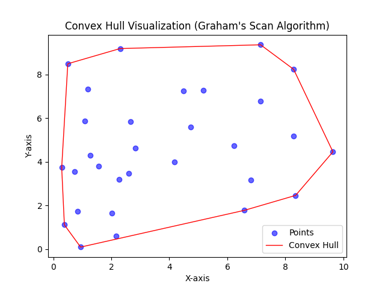
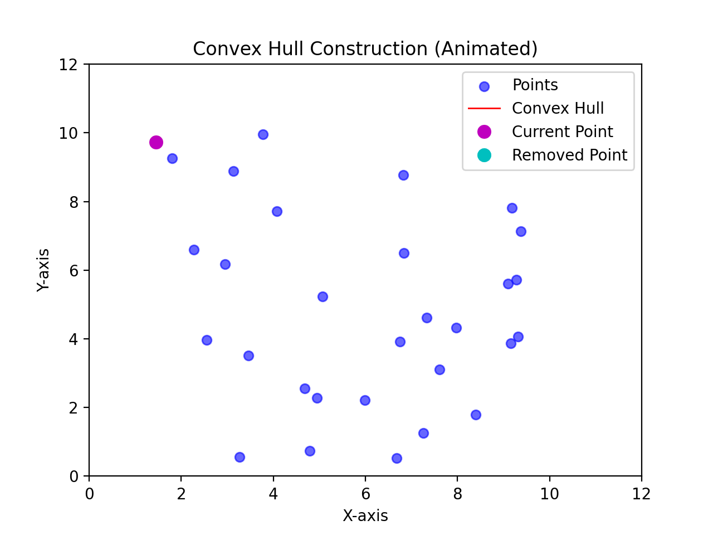
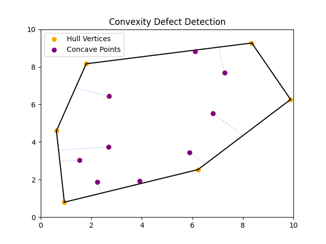

# Hull Processing

Geometry processing playground focused on convex hull construction, implemented in Python and visualized with `matplotlib`.

## Convex Hull Construction

[convex_hull.py](/convex_hull.py) computes the convex hull of a set of 2D points using Andrew's Monotone Chain.

### Steps:

1. Find the starting point by selecting the lowest point (or the leftmost if tied).
2. Sort all points by polar angle relative to the starting point to determine processing order.
3. Build the hull contour by iterating through the sorted points, removing any that introduce a concave (clockwise) turn before adding the next point.

The result is the smallest convex polygon enclosing all given points:

  

#### Processing time: `O(n log n)`, as the `O(n log n)` sorting step dominates the `O(n)` hull-building phase.

## Animated Convex Hull Construction

[convex_hull_animated.py](/convex_hull_animated.py) visualizes the step-by-step construction of a convex hull using Graham's scan. Each animation frame highlights a point as it is evaluated for inclusion: it is added if it maintains a counterclockwise turn or removed if it introduces a concave (clockwise) turn.

### Steps:
1. Sort points by x-coordinate (and y if tied) to establish a processing order.
2. Build the lower hull by iterating from left to right, adding points and removing concave turns.
3. Build the upper hull by iterating in reverse, applying the same counterclockwise rule.
4. Animate each step, highlighting points as they are evaluated, added, or removed.
5. Display the complete hull contour as the final animation frame.

The dashed red contour dynamically updates as the hull forms, and once all points are processed, the final convex hull is displayed as a solid red polygon:

  

#### Processing time: `O(n log n)`, as the `O(n log n)` sorting step dominates the `O(n)` hull-building phase.

## Hull Convexity Defect Detection

[defect_detection.py](/defect_detection.py) identifies convexity defects, i.e., concave points where a shape deviates inward from its convex hull. These defects are detected by identifying concave points and visualizing their shortest distance to the hull.

### Steps:

1. Compute the convex hull of a given set of 2D points.
2. Identify concave points (not part of the convex hull).
3. Determine the shortest distance from each concave point to its nearest hull edge.
4. Visualize defects by marking concave points and drawing dotted lines to their nearest hull edge.

The visualization highlights hull vertices (orange), concave defect points (purple), and dotted projection lines (blue) indicating the depth of each defect:

 
     

#### Processing time: `O(n log n)`, as the convex hull computation dominates, while defect detection runs in `O(n)`.
